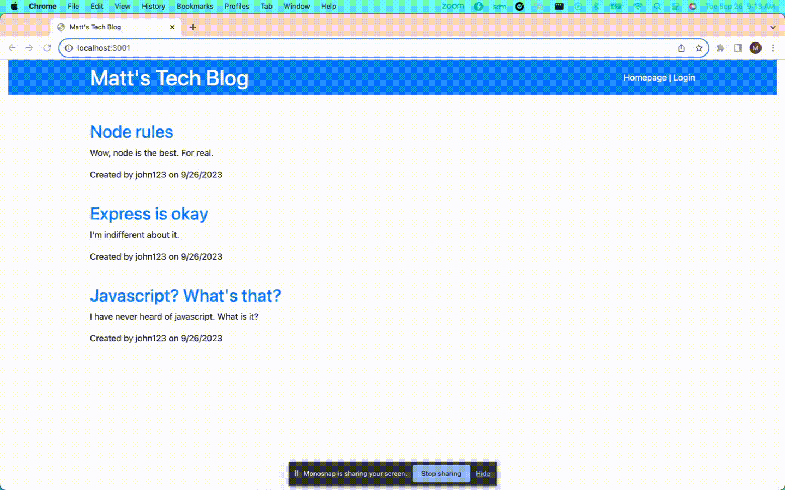

# <Tech Blog Website>

## Description

As someone who is interested in technology, and engaging in discourse about technology with others, I wanted to create a blog site.
Now, I can share my opinions with others, and interact with like-minded individuals about a topic I am passionate about!

In building this blog, I was able to explore the ins-and-outs of building an MVC application, and learned a ton in doing so. 
Also, my fundamental understanding of using Sequelize and front-end UI's was fortified. 

I am now more confident than ever in my abilities as a full-stack developer, and I am ready to apply these skills to any challenges I face in the future!

## Table of Contents

- 
  - [Description](#description)
  - [Table of Contents](#table-of-contents)
  - [Installation](#installation)
  - [Usage](#usage)
  - [Credits](#credits)
  - [License](#license)
  - [Badges](#badges)
  - [Features](#features)
  - [How to Contribute](#how-to-contribute)
  - [Tests](#tests)

## Installation

N/A

## Usage

Site URL: https://young-mountain-95763-9cfe2914182b.herokuapp.com/

1. Sign up using the login page
2. View and comment on existing posts
3. Create and delete your own posts from your dashboard

## Credits

Tutor: Dominique Meeks Gombe

Resources:
1. Get plain data from findAll: https://stackoverflow.com/questions/46380563/get-only-datavalues-from-sequelize-orm
2. Express: https://www.npmjs.com/package/express
3. Sequelize: https://sequelize.org/

## License

The MIT License

## Badges

## Features

1. User management and authentication handling
2. View posts and comments from other users
3. Create posts and comments
4. View and delete your own posts on a dashboard

## How to Contribute

N/A

## Tests

N/A